<div align="center">


# Startup Sim

**Symulator pracy w startupie IT — 2D, wieloosobowo, z przymrużeniem oka.**

[](https://github.com/mateuszpalak/startup-sim/actions/workflows/ci.yml)
[](https://github.com/mateuszpalak/startup-sim/releases/latest)
[](LICENSE)


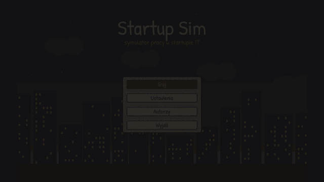

[**Pobierz na macOS**](https://github.com/mateuszpalak/startup-sim/releases/latest) ·
[Sterowanie](docs/gra/sterowanie.md) ·
[Przebieg gry](docs/gra/przebieg.md) ·
[Dokumentacja](docs/README.md) ·
[Jak pomóc](CONTRIBUTING.md)

</div>

*English: a 2D multiplayer "working at an IT startup" simulator — an
authoritative Rust server (UDP, 20 Hz) and a Godot 4 client. The game and the
docs are in Polish; contributions in English are welcome too
([CONTRIBUTING](CONTRIBUTING.md)).*

## O grze

Szukasz pracy na portalu z ogłoszeniami, przechodzisz rozmowę online,
dojeżdżasz do biura — pieszo, rowerem, tramwajem albo taksówką, w deszczu też.
Portierka zagada o ślubie, recepcja zaprowadzi do HR, HR da umowę (trochę
niższą niż na rozmowie). A potem zwykły dzień w startupie: zadania na
tablicy, kawa z ekspresu, mecz w chill roomie, obiad z recepcji i sklep na
parterze, gdzie kasjer pyta, jaka parówka jest.

Wszystko to z innymi graczami na tym samym serwerze — z czatem głosowym
i tekstowym.

## Galeria

<table>
  <tr>
    <td width="50%">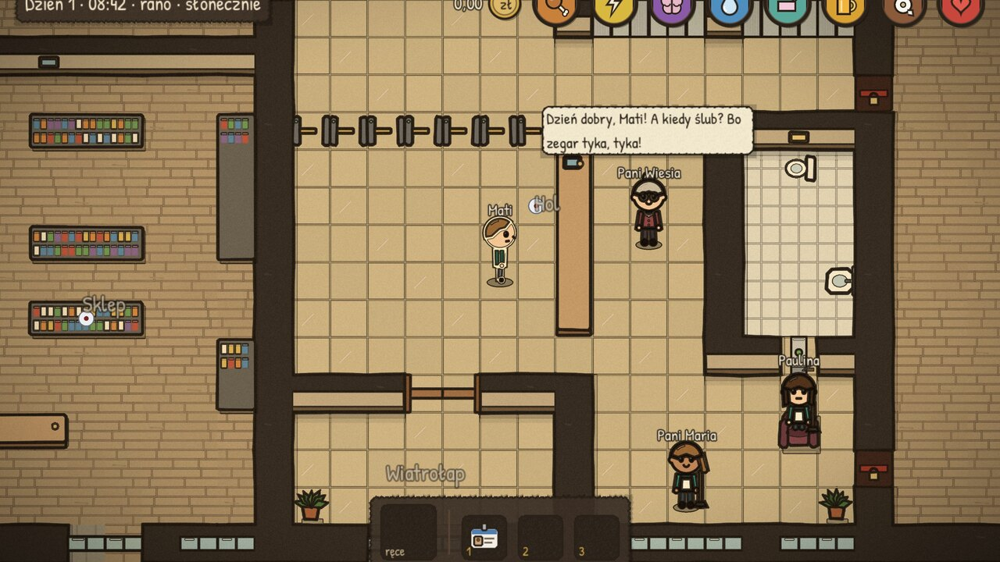<br><sub>Pani Wiesia z portierni zawsze zagada</sub></td>
    <td width="50%">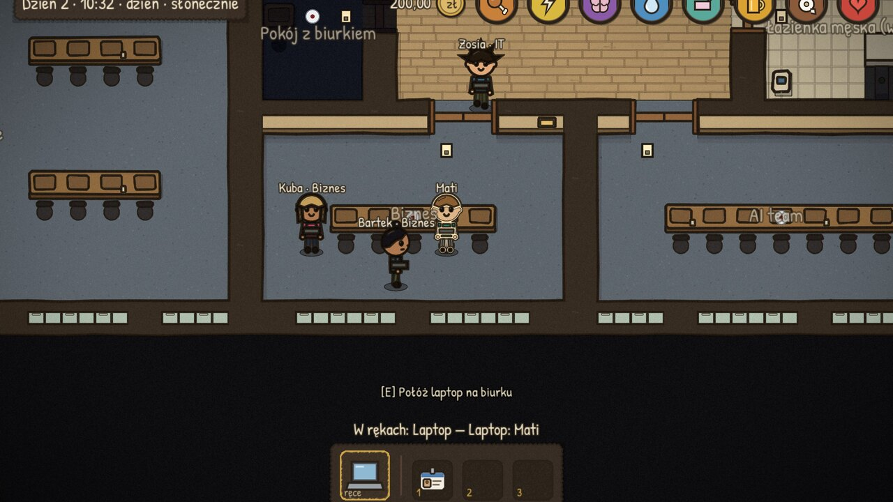<br><sub>Biuro działu Biznes — inni gracze przy biurkach</sub></td>
  </tr>
  <tr>
    <td>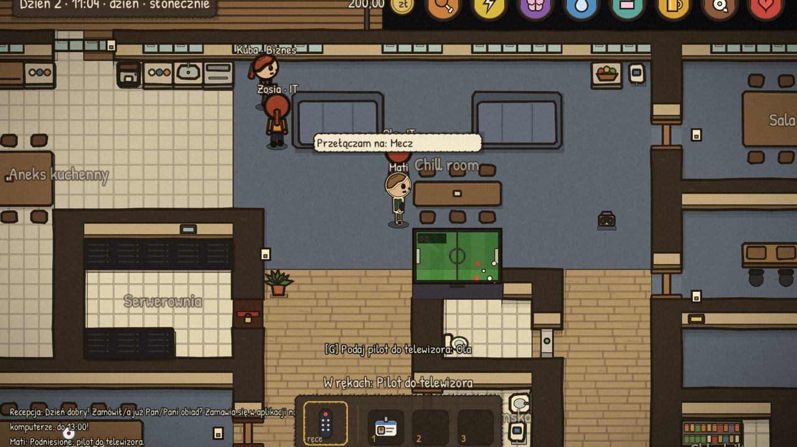<br><sub>Chill room: mecz w telewizorze, pilot w ręku</sub></td>
    <td>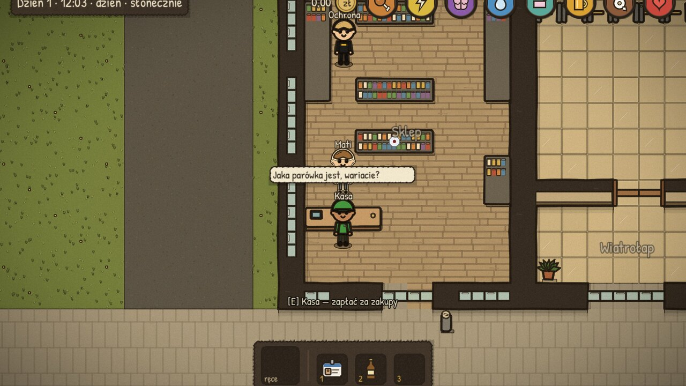<br><sub>Sklep na parterze</sub></td>
  </tr>
  <tr>
    <td>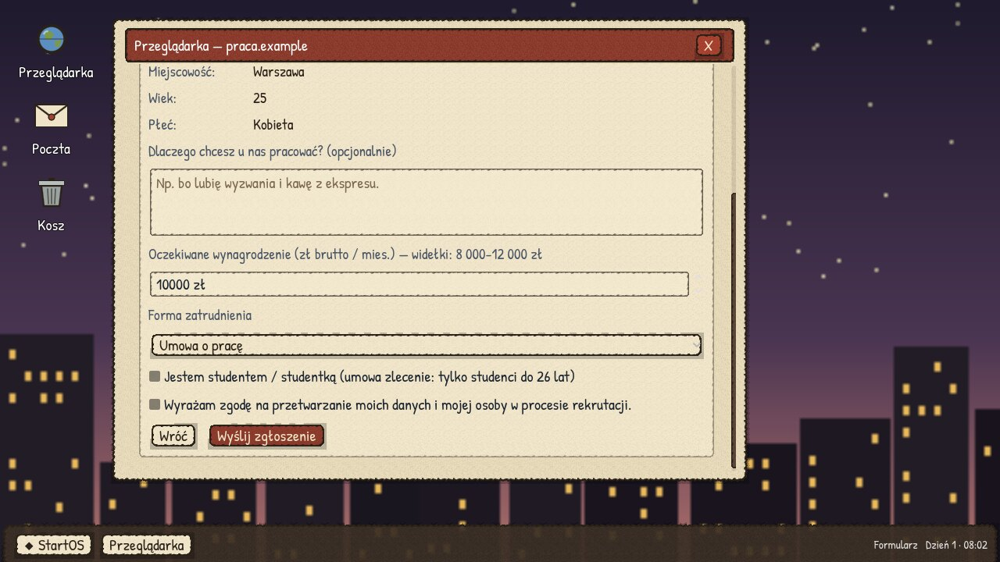<br><sub>Rekrutacja: portal z ofertami i formularz z widełkami</sub></td>
    <td>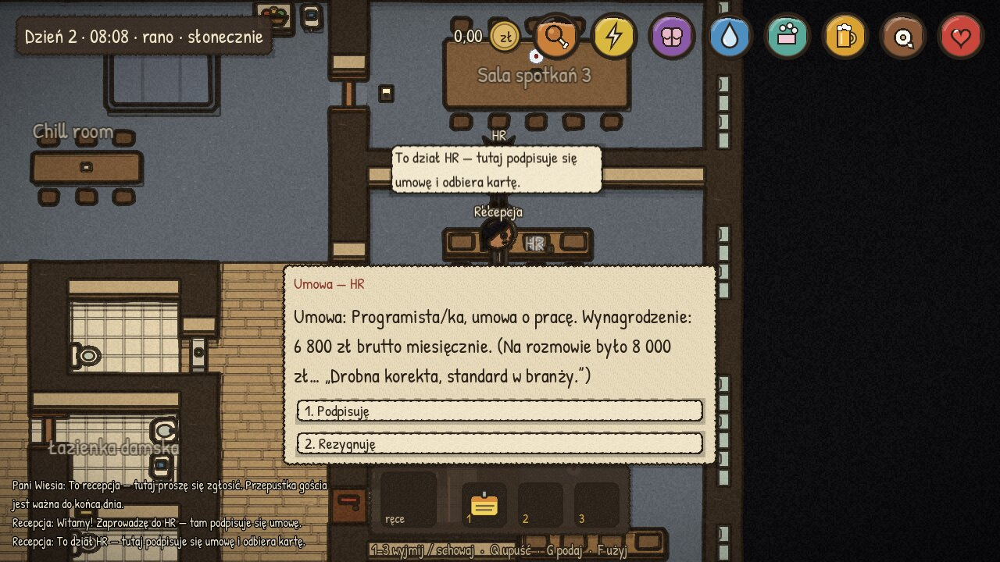<br><sub>Umowa w HR — „drobna korekta, standard w branży”</sub></td>
  </tr>
  <tr>
    <td>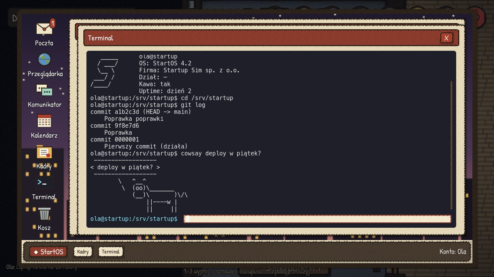<br><sub>Firmowy komputer: terminal…</sub></td>
    <td>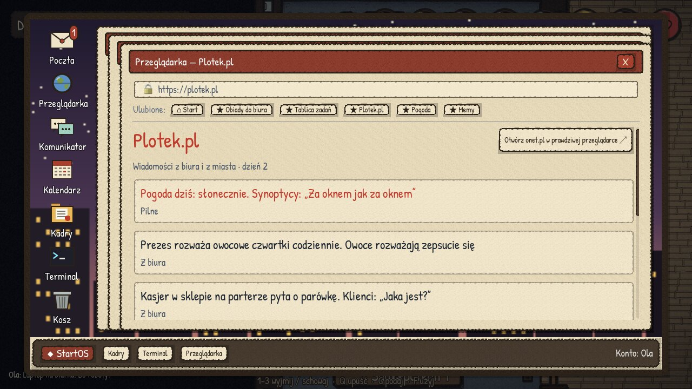<br><sub>…i przeglądarka z wiadomościami z biura</sub></td>
  </tr>
  <tr>
    <td>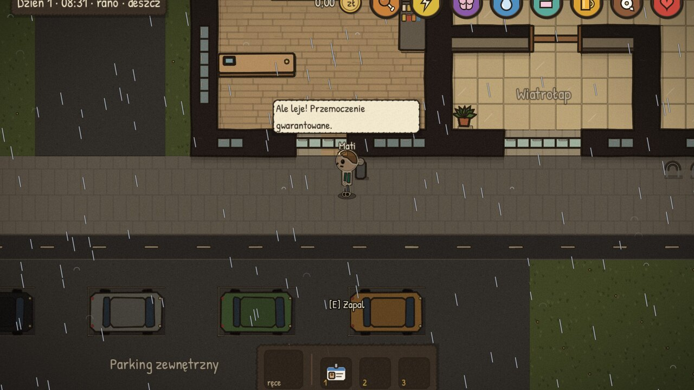<br><sub>Dojazd do pracy — pogoda zmienia się z dnia na dzień</sub></td>
    <td>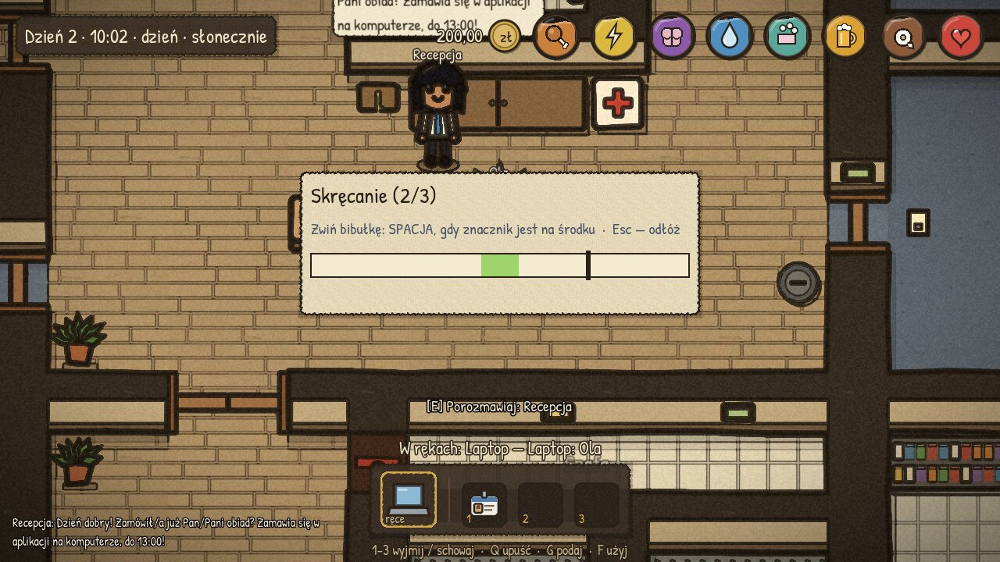<br><sub>Mini-gra: skręcanie papierosa</sub></td>
  </tr>
</table>

## Co jest w grze

- 🏢 **Budynek na kilka pięter** — hol z bramkami, windy i klatka schodowa,
  open space działów, sala zarządu, chill room, aneks kuchenny, balkon,
  łazienki, magazynek i sklep na parterze.
- 💼 **Kariera** — portal z ofertami, rozmowa online, umowa w HR (o pracę,
  B2B, zlecenie dla studenta), karta pracownika, wypłata za przepracowany
  czas; a jako założyciel — własna firma, stanowiska i rekrutacja.
- 💻 **Komputer przy biurku** — poczta, tablica zadań działu, komunikator,
  kalendarz spotkań, zamawianie obiadów, Kadry (urlop), przeglądarka i
  terminal.
- ☕ **Codzienność** — potrzeby postaci (głód, energia, higiena, pęcherz…),
  kawa w kubku, który trzeba potem umyć, słodycze i owoce, papierosy,
  telewizor i boombox, apteczka na recepcji.
- 🌦️ **Czas i pogoda** — zegar dnia pracy, pory dnia, deszcz, burza, mgła,
  światło w oknach.
- 🎙️ **Razem** — czat głosowy (do pokoju albo szeptem), czat tekstowy,
  dziennik dnia i powiadomienia.
- 😈 **Psoty** — alkohol z barku i jego skutki, nagany od zarządu, bójki,
  ochrona i policja, sprzątaczka pani Maria.
- 🎨 **Oprawa „papier i tusz”** — ręcznie rysowany wygląd, dźwięki i muzyka
  generowane kodem.

## Pobierz i graj

Gotowy klient na **macOS** (podpisany i notaryzowany dmg, Intel + Apple
Silicon): [najnowsze wydanie](https://github.com/mateuszpalak/startup-sim/releases/latest).
Gra sama sprawdza, czy jest nowsza wersja, i proponuje „Pobierz” na ekranie
tytułowym.

Na start: [sterowanie](docs/gra/sterowanie.md) i [przebieg gry](docs/gra/przebieg.md).

## Uruchomienie ze źródeł

Wymagania: Rust (rustup), Godot 4.7 (`godot` w PATH).

```bash
cd server && cargo run --release   # serwer: gra :7777 (UDP), logowanie :7778 (HTTPS)
godot --path client                # klient (można odpalić kilka razy)
```

Opcje serwera i klienta, boty, CI i wdrożenie:
[docs/dev/uruchomienie.md](docs/dev/uruchomienie.md). Testy:
[tests/README.md](tests/README.md).

## Jak to działa

```
klient Godot 4 (GDScript)  ── Input 60 Hz ──▶  serwer Rust (autorytatywny, 20 Hz)
  predykcja ruchu, interpolacja  ◀── Snapshot ──  symulacja, NPC, zapis SQLite
          └──── ten sam algorytm ruchu i format pakietów (testy golden) ────┘
```

Własny binarny protokół po UDP (szyfrowany po zalogowaniu), logowanie przez
HTTPS, jeden plik map dla serwera i klienta. Więcej:
[architektura](docs/dev/architektura.md) · [protokół](docs/dev/protokol.md) ·
[projekt gry (GDD)](docs/gdd/README.md).

## Licencja

Kod: [GNU AGPL-3.0-or-later](LICENSE) — możesz go używać, zmieniać i
udostępniać, ale zmienioną wersję (także uruchomioną jako serwer w sieci)
trzeba udostępnić na tej samej licencji. Czcionka
[Patrick Hand](client/fonts/OFL-PatrickHand.txt) (© Patrick Wagesreiter): SIL
OFL 1.1. Dźwięki, muzyka i grafika są generowane kodem z tego repozytorium.
