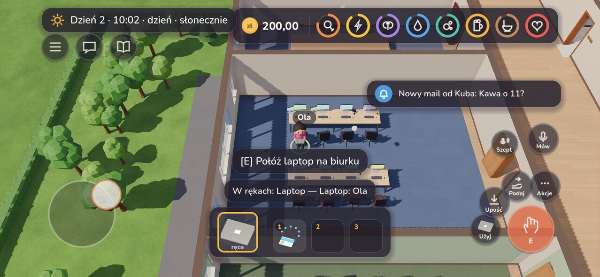

# Sterowanie

*Dla graczy · [przebieg gry](przebieg.md) · [dokumentacja](../README.md)*

## Ruch i kamera

| Klawisz | Co robi |
|---|---|
| **WASD** / strzałki | chodzenie |
| **kółko myszy**, **+ / -** | przybliż / oddal kamerę |
| **Tab** | menu akcji: kafelki z tym, co da się zrobić tu i teraz (wybór numerem albo kliknięciem) |
| **Esc** | menu gry (ustawienia, wyjście do menu / z gry); przy komputerze — wstań |
| **F3** | overlay debug (ping, FPS, pokój) |

## Interakcja — **E**

**E** działa na to, co jest obok:

- **ludzie** — rozmowa z NPC (portier, recepcja, HR — też gdy zgubisz laptop
  albo kartę, kasjer…);
- **winda** — przy drzwiach wezwij, w kabinie panel windy: na parter od razu,
  na inne piętra najpierw **przyłóż kartę** do czytnika (klik albo **K**),
  potem przycisk piętra (albo cyfra; **P** parter, **Esc** zostań);
- **biurko** — połóż laptop, usiądź do komputera (pulpit z pocztą,
  przeglądarką, tablicą zadań działu, obiadami, komunikatorem, kalendarzem,
  Kadrami, terminalem i koszem);
- **sklep na parterze** — przy półce lista towarów (**1–9** weź), przy kasie zapłać;
- **aneks kuchenny** — szafka (kubki, nóż), ekspres (panel: zaparz kawę do
  kubka, dolej wody, wyrzuć fusy), zlew (umyj kubek), zmywarka (włóż / włącz /
  rozładuj), lodówka, kosz na śmieci (fusy i resztki);
- **pojemniki** (lodówka, szafka, zmywarka, kosz, apteczka, magazynek, barek) —
  okno z zawartością obok Twojego ekwipunku: **przeciągnij myszką** (albo
  kliknij), żeby wyjąć albo włożyć;
- **chill room** — sofa, misa z owocami, ekspres, telewizor i boombox;
- **łazienka** — toaleta, umywalka, płyn antybakteryjny; **L** zamyka /
  otwiera kabinę od środka; przy sedesie ze smugą **E** — szczotka (szoruj
  myszką);
- **włącznik przy drzwiach** — zapal / zgaś światło;
- **popielniczka** — zapal (**E** ponownie — wstań);
- **przedmiot na podłodze** — podnieś;
- **drzwi** — przeczytaj tabliczkę (nazwa pomieszczenia za drzwiami, na
  środku ekranu; **E** albo **Esc** — schowaj);
- **dwa razy** przy swoim aucie / rowerze, na zachodnim końcu chodnika, na
  przystanku tramwajowym lub postoju taksówek — powrót do domu przed końcem
  dnia (wypłata za przepracowany czas); **tramwajem z przystanku zawsze**,
  niezależnie od tego, czym się przyjechało.

## Przedmioty

| Klawisz | Co robi |
|---|---|
| **1–3** | wyjmij / schowaj przedmiot z kieszeni |
| **Q** | upuść |
| **G** | podaj osobie obok |
| **F** | użyj: wypij kawę, zjedz / wypij coś ze sklepu, pokaż kartę, pilot (na ekranie pilot — wybierz kanał), boombox (na ekranie boombox — wybierz utwór), skręć papierosa z tytoniu; Zarząd: alkomat przy kimś (powyżej 0,2 ‰ można wystawić naganę, 3 nagany = zwolnienie) |

## Rozmowa

| Klawisz | Co robi |
|---|---|
| **V** (trzymaj) | mów głosem do osób w tym samym pomieszczeniu |
| **B** (trzymaj) | szeptem do osoby obok |
| **Enter** | czat tekstowy: do pokoju, `/s` szept, `/k` krzyk na całe piętro |
| **H** | dziennik dnia (historia wydarzeń) |

## Psoty

| Klawisz | Co robi |
|---|---|
| **R** | menu psot: nasikaj / zesraj się na podłogę, nasikaj do ekspresu albo komuś do kubka |
| **X** | uderz osobę obok (z nożem w rękach — dźgnij; **F** z nożem też) |

## Ekran dotykowy (iPhone, iPad)

Tylko w wersji 3D (`client3d/`). Na telefonie i tablecie gra sama włącza
sterowanie dotykiem (na komputerze: `--touch`, wtedy mysz udaje palec).

| Gest / przycisk | Co robi |
|---|---|
| **joystick** (lewy kciuk, pojawia się tam, gdzie dotkniesz) | chodzenie |
| **stuknięcie w podłogę** | idź tam |
| **stuknięcie w osobę albo mebel** | podejdź i użyj (jak **E**) |
| **dwa palce**: rozsuń / zsuń, obróć | przybliż / oddal, obróć kamerę |
| **duży przycisk z dłonią** (E) | to, co podpowiada napis nad ekwipunkiem |
| **Użyj / Upuść / Podaj** (gdy coś trzymasz) | **F / Q / G** |
| **Akcje** (⋯) | menu akcji (**Tab**) — też psoty, uderz, zamknij kabinę |
| **Mów** | trzymaj — mówisz; krótkie stuknięcie włącza mikrofon na stałe (stuknij znowu, żeby wyłączyć) |
| **Szept** | trzymaj — szept do osoby obok (**B**) |
| **☰ / dymek / książka** (u góry) | menu gry, czat, dziennik dnia |
| **kieszenie 1–3** | stuknij, żeby wyjąć / schować |
| **✕** (gdy jest otwarte okno) | zamknij (**Esc**); przy komputerze — wstań |

Mini-gry: skręcanie — przytrzymaj / stuknij palcem w dowolnym miejscu,
szczotka — szoruj palcem, pojemniki — stuknij albo przeciągnij przedmiot,
winda — stuknij czytnik i piętro. Pola tekstowe otwierają klawiaturę
ekranową, a okno z polem przesuwa się nad nią.

W ustawieniach („Sterowanie dotykiem”): joystick po prawej, wielkość i
widoczność przycisków.

## Ustawienia

W menu (albo **Esc** w grze) → Ustawienia: głośność efektów, otoczenia i
muzyki, „Oszczędzanie baterii” (30 klatek/s zamiast 60; w tle gra rysuje 20)
i „Wysyłaj raporty awarii bez pytania”. Po awarii gra przy następnym starcie
proponuje wysłanie raportu (koniec dziennika gry) na serwer.
